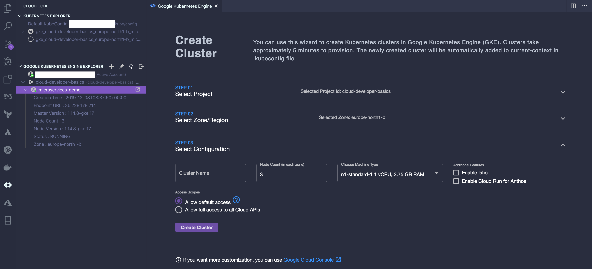

# Microservices on Google Kubernetes Engine, using Cloud Code

Cloud Code is an extension for Visual Studio Code that drastically simplifies developing applications on Google Kubernetes Engine (GKE). Under the hood it uses Skaffold, kube-ctl and Docker to package, deploy and run your app(s). You have access to a push-button setup that lets you either deploy-when-you-wish, or even do a fully continuous pipe that pushes, builds and deploys updates as you work. If you are new to Kubernetes, this is the way to do it!

The demo sets up three applications on GKE:

1. API backed by [Fastify](https://www.fastify.io) (this becomes your public endpoint)
2. Fruit service ("private", behind a NodePort)
3. Greeter service ("private", behind a NodePort)

**All in all, this example lets you build "private" microservices that are accessed through a public interface.**

While the "fruit" and "greeter" services are extremely simple nonsense services they should help to outline a working, easy-to-understand application structure when you want to drive a microservice-based application.

If you're interested in this pattern, it may be interesting for you to look at [Ambassador](https://www.getambassador.io/user-guide/getting-started/) which I also investigated while working on this, but I found it more refreshing to do something barebones from the bottom up as far as the API and routing goes.

## Prerequisites

- You should have a [Google Cloud Platform account](https://console.cloud.google.com)
- You should have your environment set up so that VS Code can pick up your profile/credentials
- You need to enable the [Kubernetes Engine API](https://console.cloud.google.com/apis/library/container.googleapis.com?q=kubernetes)
- You may need to activate [Cloud Container Registry](https://console.cloud.google.com/gcr/images/) as well
- You need to have Docker installed. The simplest way of enabling it is to use [Docker for Desktop](https://www.docker.com/products/docker-desktop); it's totally free and super simple to use
- I assume you will use [Visual Studio Code](https://code.visualstudio.com), and that you have it installed (your mileage may vary without it, as it all needs to be manual in that case, thus forfeiting the use of Cloud Code)
- You should [install the Cloud Code extension](https://cloud.google.com/code/docs/vscode/install)

## Setup

1. Rename the folder `vscode` to `.vscode`
2. In `.vscode/settings.json`, edit the fields to your own
   - `GKE_CLUSTER` should look similar to `gke_cloud-developer-basics_europe-north1-b_microservices-demo
   - `GCR_PROJECT` should look similar to `cloud-developer-basics`
3. FYI: I have removed the standard `launch.json` as I am not using that file myself
4. In `skaffold.yaml`, change each of the image names to point to your own image names (where you want them to go), in the form of `gcr.io/PROJECT/IMAGE`
5. Create a Kubernetes cluster by using the Cloud Code extension. In the panel marked `Google Kubernetes Engine Explorer` you should click the plus sign to create a new cluster. Make sure that you specify minimum 3 nodes with no smaller than n1-standard-1 machine type, since at least I have never managed to get anything smaller than that working with Kubernetes. _If you are wary about pricing ensure that you do a zonal cluster, else you will get **ZONE COUNT \* NODE COUNT** number of machines (typically 9) which is unnecessarily expensive for a demo._ Provisioning the cluster will take a few minutes.
6. **Post-deployment step**: Since we are using NodePorts for the "private" services, those will be known after first deploy. When you've done your first deployment, add their IPs and ports to `src/api/src/config/api.mjs`.

_Example of a complete, valid cluster setup minus the cluster name._

# Developing

- Use the Command Palette (CMD+SHIFT+P) to find and enable _Cloud Code: Deploy_ (once, right now) or _Cloud Code: Continuous Deploy_ (every time you save)
- Hopefully all the configuration will be correct and you should be able to start seeing at least the API; check the console output for your IP, your Cloud Code panels, or go to [the Kubernetes service & ingress view](https://console.cloud.google.com/kubernetes/discovery) to see what is going on.
- After the first deployment, please follow step 6 in the **Setup** section above to ensure the API can connect to the right IPs for the remaining services

# Further information/instructions for Cloud Code

I have kept the boilerplate README for new Cloud Code projects at `README_cloud-code.md` if you need to read up more.
